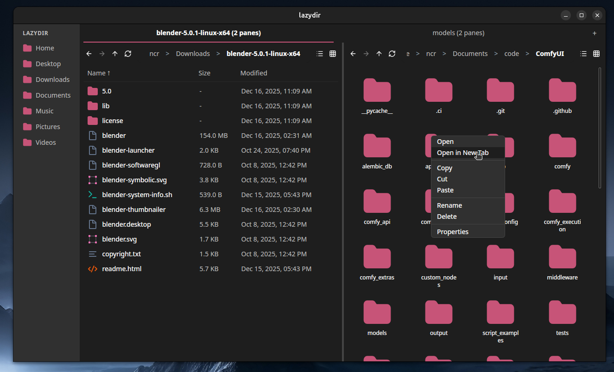
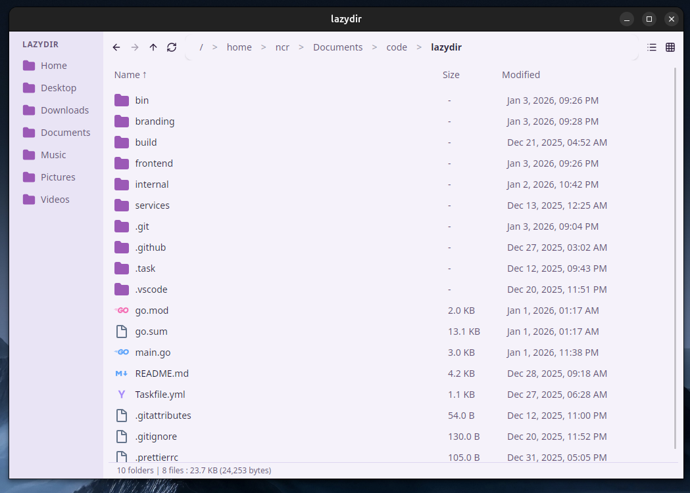
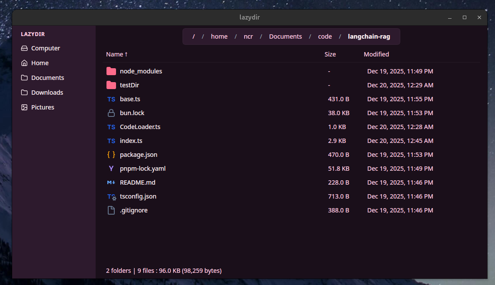

<h1 align="center">
  
  lazydir
</h1>

<p align="center">
  A cross-platform file manager you <em>probably</em> don’t need.
</p>


### WIP not finished at all

Lazydir is a file manager built with Go, Wails and React.

(i like [thunar](https://gitlab.xfce.org/xfce/thunar))



## Features

- **Tabbed Interface**: Keep multiple directories open in tabs and switch between them effortlessly.
- **Split-Screen View**: Manage files and directories side-by-side with dual panes for maximum productivity.

- **Cross-Platform**: A single, consistent experience on Linux, Windows, and macOS.
- **Custom Themes**: Personalize the look and feel to match your style.

## Installation

Packages are available for Linux distributions, Windows & MacOS. You can find the latest builds on the project's releases page.

- **Windows**:

  - Download the **installer**: `lazydir-amd64-installer.exe`
  - Or download the **portable binary**: `lazydir.exe`

<!-- - **macOS**:

  - Download the **app bundle archive**: `lazydir.app.zip`
    _(no `.dmg` is provided)_ -->

- **Debian / Ubuntu**:

  - Download the `.deb` package: `lazydir.deb`

- **Fedora / CentOS / RHEL**:

  - Download the `.rpm` package: `lazydir.rpm`

- **Arch Linux**:

  - Download the `.pkg.tar.zst` package: `lazydir.pkg.tar.zst`

## Building from Source

### Prerequisites

1.  **Go**: Install the Go programming language.
2.  **Wails v3**: Install the Wails v3 alpha by following the [official guide](https://v3alpha.wails.io/).
3.  **Task**: Install Task by following its [installation instructions](https://taskfile.dev/docs/installation).
4.  **Linux Dependencies**: If you are on Debian/Ubuntu, install the required libraries:
    ```bash
    sudo apt install build-essential pkg-config libgtk-3-dev libwebkit2gtk-4.0-dev
    ```

### Development Commands

- **Run in development mode**:
  ```bash
  task dev
  ```
- **Build the application**:
  ```bash
  task build
  ```
- **Package for distribution**:
  ```bash
  task package
  ```
- **Update embedded assets**:
  The frontend assets are embedded in the Go binary. To update them, modify the assets in `frontend/dist` and run:
  ```bash
  task common:update:assets
  ```

## 📜 License

This project is licensed under the MIT License. See the `LICENSE` file for details.

## Theme showcase

Its all CSS.





## TODO

- [x] **HIGH**: SideBar with default folders cross-platform, basic.
- [ ] **HIGH**: Keep it fast even though it's React (lazy loading, virtualized list, Go backend for first operations).
- [x] **HIGH**: Move state to the Tab/Pane level to maintain context after switching.
- [x] **MEDIUM**: Navigation buttons (Up, Left, Right) with history tracking.
- [ ] **MEDIUM**: Support for Mouse4 (Back) and Mouse5 (Forward) buttons. (needs to be done Golang side directly)
- [ ] **HIGH**: Context Menu on right-click.
- [ ] **HIGH**: File Operations:
  - [x] **HIGH**: Copy-Paste.
    - [ ] **MEDIUM**: Stream large file operation progress and display them in the UI.(progress bar)
  - [x] **LOW**: Cut-Paste.
  - [x] **HIGH**: Delete.
  - [ ] **MEDIUM**: Rename.
  - [ ] **HIGH**: New Folder.
  - [ ] **HIGH**: New File.
  - [ ] **HIGH**: Drag and Drop (complex):
    - [ ] Drag from lazydir to lazydir.
    - [ ] Drag from one lazydir pane to another pane.
    - [ ] Drag between tabs in lazydir.
    - [ ] Drag from OS to lazydir.
    - [ ] Drag from lazydir to OS.
- [ ] **HIGH**: Multi-Select files (SHIFT + Click, CTRL + Click).
- [ ] **LOW**: File Previews (at least for images).
- [x] **HIGH** Switch between List View and Grid View.
- [ ] **LOW**: Press a key to jump to files starting with that letter (like Thunar).
- [ ] **LOW**: CTRL+A to select all files in the current directory.
- [x] **LOW**: CTRL+L to focus the address bar.
- [x] **LOW**: CTRL+T to open a new tab.
- [x] **LOW**: CTRL+W to close the current tab.
- [ ] **LOW**: Terminal integration (open terminal here) - platform-specific.
- [ ] **LOW**: File Search in the current directory.
- [x] **MEDIUM**: Tab support.
- [x] **MEDIUM**: Split Screen support.
- [ ] **MEDIUM** SYMLINK support in copy/move operations.
