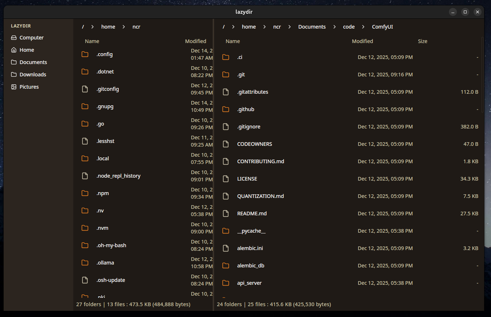

# lazydir

A cross platform file manager you probably don't need.

My toy project.

## Features

- Split screen file management
- Tabs
- Support for custom themes
- Cross platform (Linux, Windows, MacOS)

## Dev

Download and install [Wails v3 alpha](https://v3alpha.wails.io/).

Install [taskfile](https://taskfile.dev/docs/installation).

Run `task dev` to start the development server.

Run `task build` to build the
application.

Run `task package` to package the application for distribution.

on linux, you might need :

`sudo apt install build-essential pkg-config libgtk-3-dev libwebkit2gtk-4.0-dev`

## Updating embedded assets

lazydir/build/config.yml

Run `task common:update:assets` to update the embedded assets.
